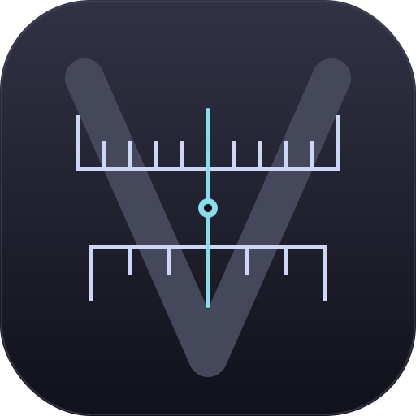

# Vernier

Native pixel-measurement overlay written in Rust. Currently supported:

- **macOS** — Apple Silicon, macOS 11+ (tested on 15 Sequoia).
- **Linux Wayland** — Hyprland is the primary development target; other
  wlroots compositors should work via the `GlobalShortcuts` portal.

Linux X11 and Windows backends exist as stubs and aren't usable yet.

Site: <https://usevernier.com>

## Install

### macOS

Download `Vernier-X.Y.Z-aarch64.dmg` from the
[latest release](https://github.com/jondkinney/vernier/releases/latest),
drag `Vernier.app` into `Applications`, and launch it. The bundle is
ad-hoc signed — the first launch shows a Gatekeeper prompt; right-click
the app → **Open** to dismiss it once.

The daemon runs as a menu-bar item (no Dock icon). Press `Cmd+,` or
click the V in the menu bar → **Preferences** to configure shortcuts
and integrations.

### Arch Linux (AUR)

Three flavors:

| Package | Source |
|---|---|
| [`vernier`](https://aur.archlinux.org/packages/vernier) | Builds from the tagged source tarball. |
| [`vernier-bin`](https://aur.archlinux.org/packages/vernier-bin) | Drops in the prebuilt x86_64 / aarch64 binary from the GitHub Release. |
| [`vernier-git`](https://aur.archlinux.org/packages/vernier-git) | Builds the tip of `main`. |

```bash
paru -S vernier-bin    # or `yay -S vernier-bin`
```

### Build from source

Rust 1.85+ (stable). System packages on Arch:

```bash
sudo pacman -S --needed \
  rust base-devel pkgconf \
  wayland wayland-protocols libxkbcommon \
  pipewire xdg-desktop-portal xdg-desktop-portal-hyprland \
  libx11 libxcb dbus \
  gtk3 libayatana-appindicator
```

```bash
cargo build --release
./target/release/vernier
```

On macOS, `packaging/macos/package.sh` builds the `.app` bundle and
DMG using `iconutil` + `create-dmg` (`brew install create-dmg
librsvg`).

## Use

`Ctrl+Shift+Alt+Super+F` (Linux) / `Ctrl+Shift+Alt+Cmd+F` (macOS)
toggles measure mode. Rebindable in **Preferences → Shortcuts**.

While measuring:

- **Drag** to draw a measurement rectangle. The pill shows W×H in
  configurable units.
- **Hover** the pill on a held rect → camera icon; click to capture
  just that region and hand off to a screenshot tool
  (`screencapture -i` on macOS, Satty / Swappy / Annotator on
  Wayland).
- **Shift** (alone) — extend the live crosshair to full-screen
  alignment lines.
- **B / V** — drop a horizontal / vertical guide; drag the guide to
  reposition, double-click to delete.
- **Right-click** — context menu (freeze stuck measurements, add
  guides, change edge-detection tolerance, change capture handoff
  target).
- **Esc** — clear the current rect and leave measure mode.
- **Cmd+, / Ctrl+,** — open the Preferences window.

The Preferences window is a separate subprocess (eframe + egui) so
the long-running daemon stays tiny and the heavier UI toolkit only
loads when you open it. On macOS it promotes itself to a foreground
app via `TransformProcessType` so it can take key focus despite the
daemon being `LSUIElement`.

## Hyprland setup

The tray icon registers as a `StatusNotifierItem`. waybar's `tray`
module renders it; the default Omarchy waybar config is already
wired up — the V appears in the *tray-expander* group on the right
side. Left-click for the menu (Preferences, Quit).

If your waybar lacks the tray module:

```jsonc
{ "modules-right": ["tray", ...],
  "tray": { "icon-size": 16, "spacing": 8 } }
```

### Hotkey wiring (three options)

**Zero setup on Hyprland.** On startup the daemon runs
`hyprctl keyword bind = …, exec, vernier toggle` itself and
re-applies the bind on `configreloaded`, so the shortcut Just Works.
The runtime bind is cleared when the daemon exits.

**Portal-based (other wlroots compositors).** The daemon registers a
`GlobalShortcuts` portal entry named `hk_1` via
`xdg-desktop-portal-hyprland` (1.3+). Map a key to it:

```
bind = SHIFT CTRL ALT SUPER, F, global, vernier:hk_1
```

**Manual CLI bind.** Skip the portal entirely:

```
bind = SHIFT CTRL ALT SUPER, F, exec, vernier toggle
```

`vernier toggle` talks to the running daemon over a Unix domain
socket at `$XDG_RUNTIME_DIR/vernier.sock` — no portal required.

## Layout

Cargo workspace:

```
crates/
├── vernier-core/      algorithms, geometry, settings
├── vernier-platform/  Platform trait + per-OS impls
│                      (macOS + Linux Wayland; X11 + Windows are stubs)
├── vernier-ui/        egui prefs window (separate subprocess)
└── vernier-app/       binary
```

`vernier-platform` exposes a `Platform` trait the rest of the
codebase binds against. The HUD is rasterized in `vernier-platform`
via `tiny-skia` and split into a cached **static** layer (held
rects, guides, stuck pills) and a **dynamic** layer (live crosshair,
cursor, toast) so most frames skip the expensive stroke pass — only
the small dynamic layer re-renders when the cursor moves.

Linux backend autoselects Wayland when `$WAYLAND_DISPLAY` is set;
the X11 fallback isn't implemented yet.

## License

MIT OR Apache-2.0, at your option. See `LICENSE-MIT` and
`LICENSE-APACHE`.
