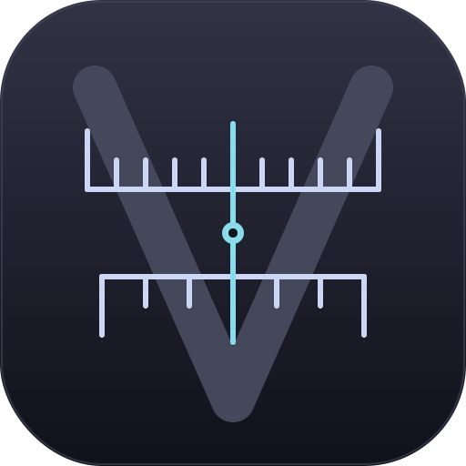

# Vernier

Native pixel-measurement overlay written in Rust. Currently supported:

- **macOS** — Apple Silicon, macOS 11+ (tested on 15 Sequoia).
- **Linux Wayland** — Hyprland is the primary development target; other
  wlroots compositors should work via the `GlobalShortcuts` portal.

Linux X11 and Windows backends exist as stubs and aren't usable yet.

Site: <https://usevernier.com>

## Install

### macOS

Download `Vernier-X.Y.Z-aarch64.dmg` from the
[latest release](https://github.com/jondkinney/vernier/releases/latest),
drag `Vernier.app` into `Applications`, and launch it. The bundle is
ad-hoc signed — the first launch shows a Gatekeeper prompt; right-click
the app → **Open** to dismiss it once.

The daemon runs as a menu-bar item (no Dock icon). Press `Cmd+,` or
click the V in the menu bar → **Preferences** to configure shortcuts
and integrations.

### Arch Linux (AUR)

Three flavors:

| Package | Source |
|---|---|
| [`vernier`](https://aur.archlinux.org/packages/vernier) | Builds from the tagged source tarball. |
| [`vernier-bin`](https://aur.archlinux.org/packages/vernier-bin) | Drops in the prebuilt x86_64 / aarch64 binary from the GitHub Release. |
| [`vernier-git`](https://aur.archlinux.org/packages/vernier-git) | Builds the tip of `main`. |

```bash
paru -S vernier-bin    # or `yay -S vernier-bin`
```

### Omarchy Shell companion

The companion is optional. Vernier still exposes a standard
`StatusNotifierItem` for non-Quickshell tray hosts such as Waybar and KDE.
Omarchy 4.0+ users running its Quickshell-based shell can instead add Vernier
as a native bar widget. This requires an active Wayland/UWSM session and
network access for the Git clone; using the panel's first-launch installer
also requires AUR access and a terminal in which package-manager prompts can
be answered.

```bash
omarchy plugin add https://github.com/jondkinney/vernier.git --enable
```

Omarchy asks you to approve the third-party, unsandboxed plugin before cloning
and enabling it. The widget is placed on the right side of the bar by default.

Left-click the V to open its control panel. If Vernier is not installed yet,
the panel offers **Install Vernier** and opens a visible terminal for the AUR
install, including any required prompts. It installs and verifies
`vernier-bin` (available for x86_64 and aarch64), hands the daemon to UWSM, and
the widget connects when the daemon is ready. Nothing is installed just
because the widget loads.

With a companion-aware Vernier release connected, middle-click toggles
measuring and right-click opens Preferences. The panel also shows the current
mode and live counts for held rectangles, guides, and pinned measurements.
Clicking **Clear** removes that content without leaving measure mode; the
shortcut displayed beside it is the configured **Clear & Exit** shortcut and
does leave measure mode when pressed. Older Vernier releases retain basic
toggle, Preferences, and quit controls in legacy mode.

Update only this companion with its plugin id:

```bash
omarchy plugin update com.jondkinney.vernier
```

Remove it with:

```bash
omarchy plugin remove com.jondkinney.vernier
```

Removing the companion does not stop or uninstall Vernier; its portable tray
item returns automatically. The normal `omarchy update` flow updates an
AUR-installed Vernier package.

See [packaging/omarchy/README.md](packaging/omarchy/README.md) for behavior,
security boundaries, and development details.

### Cargo (any Linux distro)

For distros without a native package, install from crates.io:

```bash
cargo install vernier-rs    # compiles from source, installs the `vernier` binary
```

The crate is `vernier-rs` because the bare `vernier` name was already
taken; the installed binary is still `vernier`. You need Rust 1.85+ and
the system build/runtime libraries — `pkgconf` plus the `wayland`,
`libxkbcommon`, `pipewire`, `fontconfig`, `freetype2` and `libglvnd`
(OpenGL) dev packages (see *Build from source* for the exact Arch
names; other distros name them similarly).

The first time you run `vernier`, the daemon registers itself with
your application launcher — it writes `vernier.desktop` and the icon
theme under `~/.local/share`, no extra step needed. To register it
*before* the first launch, run `vernier install-desktop`.

`cargo install` can't pull in the optional capture/clipboard tools
(`grim`, `slurp`, `wl-clipboard`, `libnotify`). Run `vernier doctor`
to see which are missing — the related features degrade gracefully
until you install them.

### Build from source

Rust 1.85+ (stable). System packages on Arch:

```bash
sudo pacman -S --needed \
  rust base-devel pkgconf \
  wayland wayland-protocols libxkbcommon \
  pipewire xdg-desktop-portal xdg-desktop-portal-hyprland \
  libx11 libxcb dbus \
  gtk3 libayatana-appindicator
```

```bash
cargo build --release
./target/release/vernier
```

On macOS, `packaging/macos/package.sh` builds the `.app` bundle and
DMG using `iconutil` + `create-dmg` (`brew install create-dmg
librsvg`).

## Use

`Ctrl+Shift+Alt+Super+F` (Linux) / `Ctrl+Shift+Alt+Cmd+F` (macOS)
toggles measure mode. Rebindable in **Preferences → Shortcuts**.

While measuring:

- **Drag** to draw a measurement rectangle. The pill shows W×H in
  configurable units.
- **Hover** the pill on a held rect → camera icon; click to capture
  just that region and hand off to a screenshot tool
  (`screencapture -i` on macOS, Satty / Swappy / Annotator on
  Wayland).
- **Shift** (alone) — extend the live crosshair to full-screen
  alignment lines.
- **B / V** — drop a horizontal / vertical guide; drag the guide to
  reposition, double-click to delete.
- **Right-click** — context menu (freeze stuck measurements, add
  guides, change edge-detection tolerance, change capture handoff
  target).
- **Esc** — clear the current rect and leave measure mode.
- **Cmd+, / Ctrl+,** — open the Preferences window.

The Preferences window is a separate subprocess (eframe + egui) so
the long-running daemon stays tiny and the heavier UI toolkit only
loads when you open it. On macOS it promotes itself to a foreground
app via `TransformProcessType` so it can take key focus despite the
daemon being `LSUIElement`.

### Figma integration (optional)

Vernier Bridge reports the active Figma file's viewport zoom to the local
Vernier process, allowing measurements to be shown in Figma canvas pixels at
any zoom level. From Figma it reads only `figma.viewport.zoom` and whether the
editor is in Design or Dev Mode; its panel also reports whether its tab is
visible. It does not read or change layers, text, comments, selections, or
other file content. Its only network connection is a loopback WebSocket to
`localhost:8765` on the same computer, where Vernier listens on `127.0.0.1`.

Install the official
[Vernier Bridge plugin](https://www.figma.com/community/plugin/1673041143009172236/vernier-bridge)
from Figma Community. Maintainers can also run the development build using
Figma Desktop on macOS by following
[figma-plugin/README.md](figma-plugin/README.md). Figma requires its desktop app
for importing and publishing development plugins.

Zoom correction is currently focus-safe in Figma Desktop on macOS and Figma
Web under Hyprland on Linux. The plugin can connect from Figma Web on other
Linux desktops, but Vernier deliberately leaves
measurements in ordinary screen pixels there until it has a trustworthy
active-window backend. The rest of Vernier continues to work normally, with or
without Figma or Quickshell.

Run Vernier Bridge once in each Figma file or tab where you want zoom-corrected
measurements, then keep its small connection window open. Figma allows only one
plugin to run at a time, so starting another plugin stops the bridge; run
Vernier Bridge again afterward.

## Hyprland setup

The Linux tray icon registers as a standard `StatusNotifierItem`, so a tray
host such as Omarchy Shell, Waybar, or KDE can render it. Left-click opens
Preferences; right-click exposes Vernier's tray menu.

When the optional Omarchy companion is loaded against a companion-aware
Vernier release, it renews a short lease with the daemon and the generic item
becomes passive, avoiding duplicate V icons.
If Quickshell exits, reloads, or loses contact, the lease expires after 15
seconds and the generic tray item returns automatically.

If your waybar lacks the tray module:

```jsonc
{ "modules-right": ["tray", ...],
  "tray": { "icon-size": 16, "spacing": 8 } }
```

### Hotkey wiring (three options)

**Zero setup on Hyprland.** On startup the daemon runs
`hyprctl keyword bind = …, exec, vernier toggle` itself and
re-applies the bind on `configreloaded`, so the shortcut Just Works.
The runtime bind is cleared when the daemon exits.

**Portal-based (other wlroots compositors).** The daemon registers a
`GlobalShortcuts` portal entry named `hk_1` via
`xdg-desktop-portal-hyprland` (1.3+). Map a key to it:

```
bind = SHIFT CTRL ALT SUPER, F, global, vernier:hk_1
```

**Manual CLI bind.** Skip the portal entirely:

```
bind = SHIFT CTRL ALT SUPER, F, exec, vernier toggle
```

`vernier toggle` talks to the running daemon over a Unix domain
socket at `$XDG_RUNTIME_DIR/vernier.sock` — no portal required.

Shell integrations can use `vernier status` for a versioned JSON snapshot,
`vernier activate` / `vernier deactivate` for idempotent control, and
`vernier clear` to remove all held measurements without changing the active
mode. `vernier start` starts the daemon only when it is not already responsive.

## Layout

Cargo workspace:

```
crates/
├── vernier-core/      algorithms, geometry, settings
├── vernier-platform/  Platform trait + per-OS impls
│                      (macOS + Linux Wayland; X11 + Windows are stubs)
├── vernier-ui/        egui prefs window (separate subprocess)
└── vernier-app/       binary
```

`vernier-platform` exposes a `Platform` trait the rest of the
codebase binds against. The HUD is rasterized in `vernier-platform`
via `tiny-skia` and split into a cached **static** layer (held
rects and stuck pills) and a **dynamic** layer (guides, live
crosshair, cursor, toast) so pointer-driven guide placement never
rebuilds the full-screen static cache.

Linux backend autoselects Wayland when `$WAYLAND_DISPLAY` is set;
the X11 fallback isn't implemented yet.

## License

MIT OR Apache-2.0, at your option. See `LICENSE-MIT` and
`LICENSE-APACHE`.
